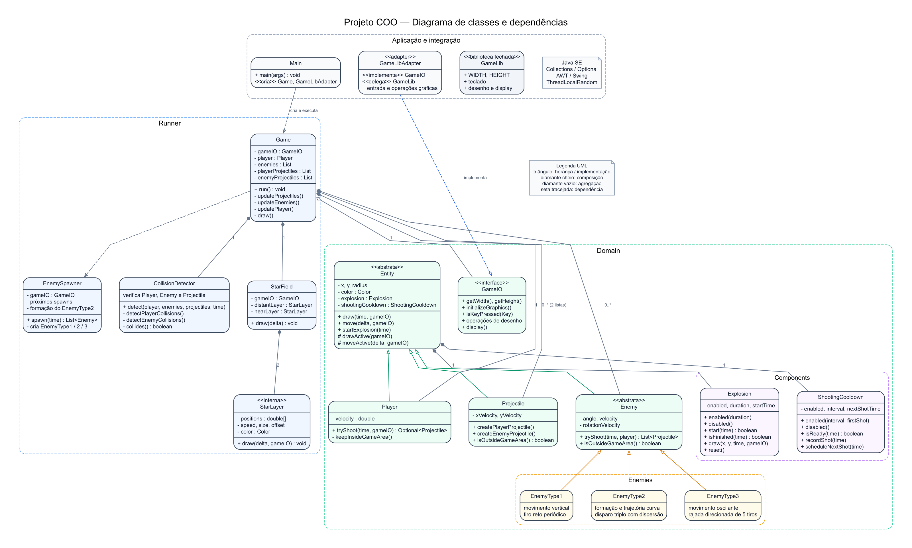

## Estrutura

- `Domain`: entidades, inimigos e componentes.
- `Runner`: loop do jogo, spawns, colisões e cenário.
- `GameLibAdapter`: conecta o domínio à `GameLib`, que permanece fechada.
- `docs`: enunciado e diagrama do projeto.

## Diagrama UML

